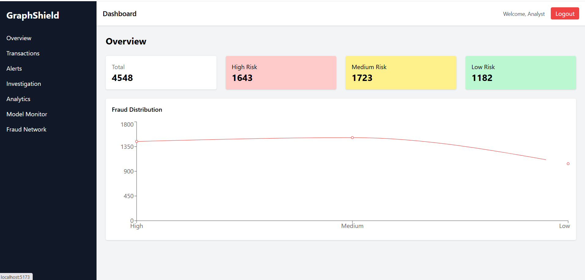
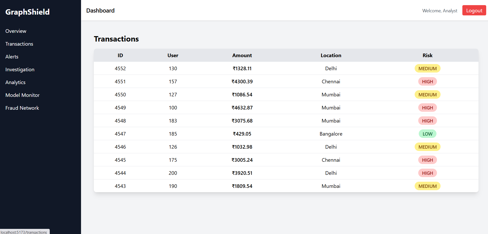
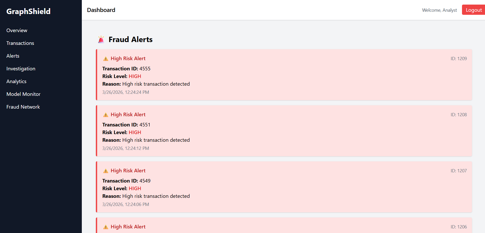
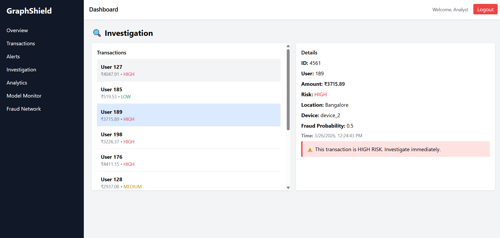
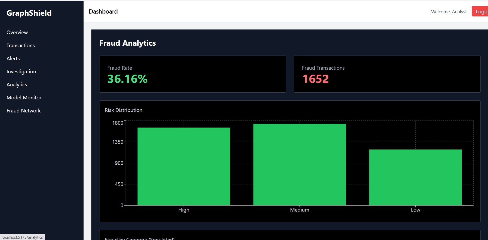
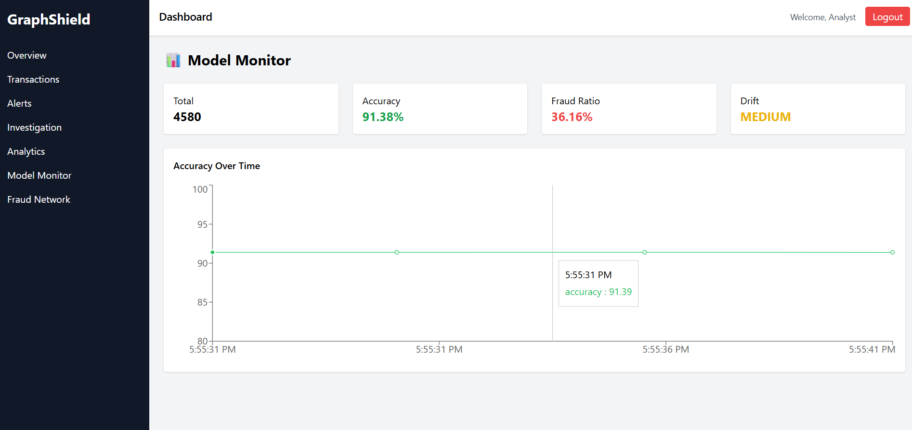
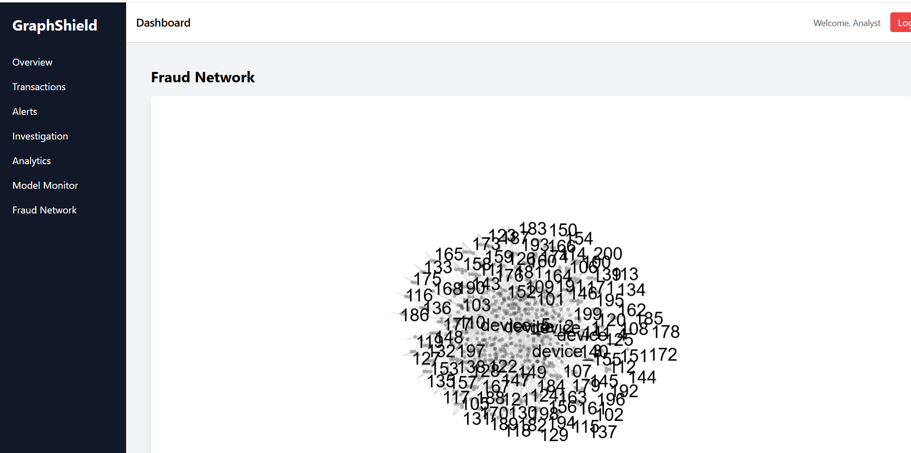
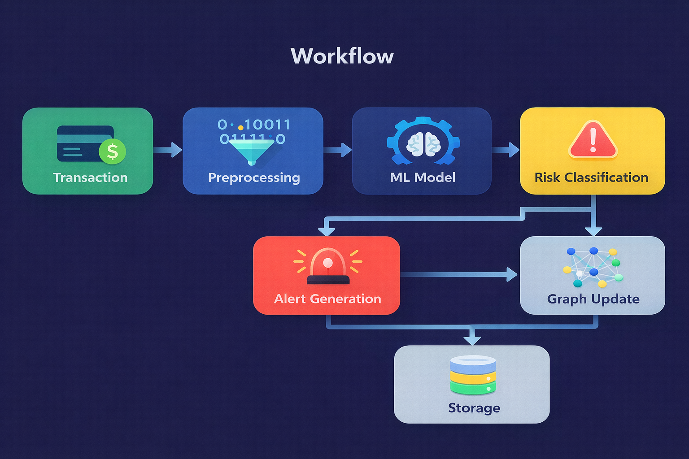

# 🚀 GraphShield AI

### Real-Time Fraud Detection & Risk Analytics Platform

<!-- <p align="center">
  
</p> -->

A full-stack fraud detection platform that leverages machine learning and graph-based analysis to identify, analyze, and visualize suspicious transactions in real time.

---

## 📑 Table of Contents

* Overview
* Features
* Technologies Used
* Screenshots
* System Workflow
* Setup
* Usage
* Project Structure
* API Endpoints
* Future Improvements
* Contributing
* License

---

## 📌 Overview

GraphShield AI is a full-stack fraud detection platform designed to identify and analyze suspicious financial transactions in real time. It combines machine learning with graph-based analysis to move beyond isolated predictions and uncover hidden relationships between users, devices, and activities.

The system continuously processes transaction data, assigns risk levels, and generates alerts for potentially fraudulent behavior. Alongside this, it provides interactive dashboards and network visualizations that make it easier to understand patterns, investigate anomalies, and take informed action.

By bringing together real-time processing, predictive modeling, and relationship analysis, GraphShield AI offers a practical approach to modern fraud detection—focused not just on identifying risk, but on making it interpretable and actionable.

---

## ✨ Features

### 🔍 Fraud Detection

* Machine learning-based fraud prediction
* Risk classification: **Low / Medium / High**
* Preprocessing and feature engineering pipeline

### ⚡ Real-Time Processing

* Continuous transaction simulation
* Live dashboard updates
* Event-driven architecture

### 🚨 Alert System

* Automatic high-risk alerts
* Timestamped alerts with reasons
* Investigation-ready interface

### 🌐 Fraud Network Graph

* Visualizes **User ↔ Device relationships**
* Detects suspicious clusters
* Helps uncover hidden fraud patterns

### 📊 Analytics Dashboard

* Fraud rate insights
* Risk distribution visualization
* Category-based fraud trends

### 🤖 Model Monitoring

* Accuracy tracking over time
* Fraud ratio monitoring
* Drift detection

---

## 🛠️ Technologies Used

### Frontend

* React.js
* Tailwind CSS
* Recharts
* React Force Graph

### Backend

* FastAPI
* SQLAlchemy
* SQLite
* Uvicorn

### Machine Learning

* Scikit-learn
* Custom preprocessing pipeline

---

## 📸 Screenshots

### 🔹 Overview Dashboard

<p align="center">
  
</p>

### 🔹 Transactions Monitoring

<p align="center">
  
</p>

### 🔹 Fraud Alerts

<p align="center">
  
</p>

### 🔹 Investigation Panel

<p align="center">
  
</p>

### 🔹 Analytics Dashboard

<p align="center">
  
</p>

### 🔹 Model Monitoring

<p align="center">
  
</p>

### 🔹 Fraud Network Graph

<p align="center">
  
</p>

---

## 🧠 System Workflow

Transaction → Preprocessing → ML Model → Risk Classification
→ Alert Generation → Graph Update → Storage

<p align="center">
  
</p>

---

## ⚙️ Setup

### 1. Clone Repository

```bash
git clone https://github.com/SrashtiChauhan/GraphShield-AI-Real-Time-Fraud-Detection-Risk-Analytics-Platform.git
cd GraphShield-AI-Real-Time-Fraud-Detection-Risk-Analytics-Platform
```

---

### 2. Backend Setup

```bash
cd backend

python -m venv venv

# Activate environment
venv\Scripts\activate        # Windows
# source venv/bin/activate   # Mac/Linux

pip install -r requirements.txt

uvicorn backend.main:app --reload
```

Backend runs on:
👉 http://127.0.0.1:8000

---

### 3. Frontend Setup

```bash
cd frontend

npm install
npm run dev
```

Frontend runs on:
👉 http://localhost:5173

---

## ▶️ Usage

* Monitor transactions in real time
* Identify high-risk activities
* Analyze fraud patterns using dashboards
* Investigate suspicious transactions
* Explore fraud network relationships

---

## 📁 Project Structure

```
GraphShield-AI/

backend/
  api/
  database/
  models/
  services/
  storage/
  utils/
  main.py

frontend/
  public/
  src/
    components/
    pages/
    services/
    App.jsx

data/
  creditcard.csv

notebooks/
  eda.ipynb
  model_training.ipynb

assets/
  (screenshots & workflow)

README.md
requirements.txt
graphshield.db
```

---

## 📡 API Endpoints

### Prediction

* POST `/predict` → Fraud prediction

### Data

* GET `/transactions` → Fetch transactions
* GET `/alerts` → Fraud alerts
* GET `/graph` → Network graph data
* GET `/analytics` → Dashboard insights

### Model

* GET `/model-stats` → Model performance

---

## 🚀 Future Improvements

* JWT-based authentication
* Model retraining pipeline
* Graph-based ML models
* Cloud deployment (AWS / Docker)
* Real-world dataset integration

---

## 🤝 Contributing

Contributions are welcome!

* Fork the repository
* Create a new branch (`git checkout -b feature-name`)
* Commit your changes
* Push to your branch
* Create a Pull Request

---

## 👩‍💻 Author

**Srashti Chauhan**
B.Tech CSE | Software Engineer

---

## ⭐ Support

If you found this project useful, consider giving it a ⭐ on GitHub.

